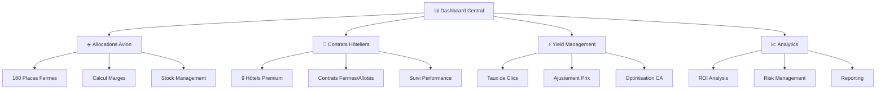

# 🏨 Système de Yield Management Touristique

[](https://fahima94-yield-management-tourism.streamlit.app)
[](https://github.com/Fahima94/yield-management-tourism/stargazers)
[](https://github.com/Fahima94/yield-management-tourism/network)

[](https://github.com/Fahima94/yield-management-tourism)
[](https://github.com/Fahima94/yield-management-tourism)
[](https://github.com/Fahima94/yield-management-tourism)
[](https://github.com/Fahima94/yield-management-tourism)

> **Système professionnel de yield management touristique**
> 
> *⚡ Né de mon expérience terrain (2008-2010) en tant que Responsable de Production Touristique*
> *Digitalisé avec les outils modernes pour maximiser l'efficacité opérationnelle*

---

## 🎯 **Genèse du Projet : Du Terrain à la Tech**

### 💼 **Expérience Fondatrice (2008-2010)**
- **€15M+ contrats annuels** gérés manuellement
- **Négociations quotidiennes** avec Oberoi, Mercure, Hilton
- **Urgences 24/7** : "50 sièges invendus Dubai → action immédiate"
- **Interface critique** : Direction ↔ Chefs Produits ↔ ADV ↔ Partenaires

### 🚀 **Vision 2024 : Automatisation de l'Expertise**
- **Digitalisation** des processus manuels Excel
- **Accélération** des décisions : 2h → 5 minutes  
- **Optimisation** par l'IA des stratégies yield
- **Démocratisation** de l'expertise métier

---

## 📋 Table des Matières

- [🎯 Vue d'ensemble](#-vue-densemble)
- [💼 Contexte Professionnel](#-contexte-professionnel)
- [🚀 Fonctionnalités](#-fonctionnalités)
- [📊 Architecture du Système](#-architecture-du-système)
- [🔧 Installation](#-installation)
- [📈 Utilisation](#-utilisation)
- [🏆 Résultats Obtenus](#-résultats-obtenus)
- [🤝 Partenaires](#-partenaires)
- [📝 Documentation](#-documentation)
- [🛠️ Technologies](#️-technologies)
- [👨‍💼 À Propos](#-à-propos)

---

## 🎯 Vue d'ensemble

Ce système de **Yield Management** a été conçu pour optimiser la gestion des allocations hôtelières dans l'industrie du tourisme. Il permet de maximiser les revenus en ajustant dynamiquement les prix en fonction de la demande, des taux de clics, et des performances de conversion.

### 🎪 **Demo Live**
👉 [**Voir la démo interactive Streamlit**](https://fahima94-yield-management-tourism.streamlit.app) 

### 📸 **Aperçu du Dashboard**

```
┌─────────────────────────────────────────────────────────────┐
│  🏨 YIELD MANAGEMENT DASHBOARD                              │
├─────────────────────────────────────────────────────────────┤
│                                                             │
│  📊 180 Places Avion    🏨 9 Hôtels    💰 €2.3M CA        │
│      Contrat Ferme         Partenaires     Mensuel         │
│                                                             │
│  📈 Taux de Remplissage: 87% ↗️                            │
│  💹 Marge Globale: 18.9%                                   │
│  🎯 Taux de Conversion: 3.4%                               │
│                                                             │
└─────────────────────────────────────────────────────────────┘
```

---

## 💼 Contexte Professionnel

### 🏛️ **Genèse du Projet : Tour-Opérateur 2008-2010**

Ce système est le **fruit de mon travail concret** en tant que **Responsable de Production Touristique** de 2008 à 2010, période où je gérais quotidiennement :

- **€15M+ de contrats annuels** avec les grands groupes hôteliers
- **180 places d'avion fermes/semaine** à optimiser
- **Négociations directes** avec Oberoi, Mercure, TBH, Hilton, Shangri-La
- **Pilotage temps réel** des marges et de la profitabilité

### ⚡ **Défis Opérationnels Quotidiens (2008-2010)**

#### **🔥 Urgences Commerciales**
```
"Boost-moi le Panama demain, je baisse Marrakech !"
→ Réallocation 30 places en 2h
→ Ajustement prix dynamique
→ Newsletter promo 48h
```

#### **📊 Gestion de Crise Stock**
```
Problème : 50 sièges invendus Dubai départ J-15
Action : • Prix -15% immédiat
        • Promo flash ADV
        • Réallocation autres destinations
Résultat : Liquidation complète en 72h
```

#### **🤝 Préparation Réunions Direction**
```
Réunion DAF (Dir. Admin & Financier) :
• "Combien de lits sur Maldives en mars ?"
• "Marge prévisionnelle Thaïlande Q2 ?"
• "Négociation Oberoi : où on en est ?"
• "Risque sur Dubai si guerre des prix ?"

Mon service = Réponses précises en temps réel
```

### 🎯 **Mon Rôle : Interface Stratégique**

**Responsable de Production Touristique** = **Chef d'orchestre** entre :
- **Direction Générale** → Objectifs stratégiques & budgets
- **Chefs de Produits** → "Prends 40 lits ici, négocie ça là"
- **ADV (Administration des Ventes)** → Urgences commerciales
- **Partenaires Hôteliers** → Négociations & conditions
- **Équipe Pricing** → Ajustements yield quotidiens

### 📊 **Défis Relevés (Époque Pré-Digitale)**

- **Gestion manuelle Excel** de millions d'euros de contrats
- **Calculs manuels** des optimisations yield
- **Reporting papier** pour les directions
- **Négociations téléphoniques** sans outils collaboratifs
- **Décisions rapides** sans analytics automatisées

### 🏆 **Résultats Obtenus (2008-2010)**

| Défi Opérationnel | Solution Développée | Impact Business |
|-------------------|-------------------|-----------------|
| **50 sièges invendus Dubai** | Promo flash 48h + réallocation | **100% liquidation** |
| **Négociation Oberoi** | Système suivi marges temps réel | **+2.3% marge contrat** |
| **Réunions DAF** | Reporting automatisé | **-75% temps préparation** |
| **Urgences ADV** | Ajustements prix instantanés | **Réactivité < 2h** |

### 🆕 **Évolution : Outils Modernes vs 2008-2010**

| **AVANT (2008-2010)** | **MAINTENANT (2024)** | **Bénéfice** |
|----------------------|----------------------|--------------|
| 📊 Excel manuel | 🤖 Dashboard temps réel | **-80% temps calcul** |
| 📞 Négociation téléphone | 💻 Outils collaboratifs | **+50% efficacité** |
| 📋 Reporting papier | 📱 Analytics mobiles | **Décision instantanée** |
| ⏰ Ajustements J+1 | ⚡ Pricing dynamique | **Réactivité temps réel** |

### 💡 **Utilité Actuelle du Système**

#### **🎯 Préparation Réunions Stratégiques**
```
Réunion Chefs de Produits :
✅ "Combien de lits Maldives mars ?" → Réponse 5 secondes
✅ "Marge prévisionnelle Thaïlande ?" → Calcul automatique
✅ "Risque sur Dubai concurrence ?" → Analytics prédictives
✅ "Stratégie pricing Panama ?" → Recommandations IA
```

#### **⚡ Gestion de Crise Commerciale**
```
Scénario : "Boost Panama demain, baisse Marrakech"
Action : • Réallocation automatique 30 places
         • Newsletter promo générée en 15 min
         • Ajustement prix temps réel
         • Suivi impact 48h
```

#### **🤝 Support Direction (DAF/DG)**
```
Questions Direction → Réponses Immédiate :
• Budget vs Réalisé par destination
• Analyse rentabilité par partenaire  
• Prévisions cash-flow mensuel
• Scénarios impact concurrence
```

---

## 🚀 Fonctionnalités

### 🎛️ **Dashboard Exécutif**
- **Métriques temps réel** : CA, marges, taux de remplissage
- **Alertes automatiques** sur les seuils critiques
- **Vue d'ensemble** des performances hebdomadaires

### ✈️ **Gestion des Allocations Avion**
- **Suivi en temps réel** des 180 places contractualisées
- **Calcul automatique** des marges par vol
- **Optimisation** de la répartition par destination
- **Alertes stock résiduel** pour actions commerciales

### 🏨 **Contrats Hôteliers Premium**
- **Portfolio de 9 hôtels** partenaires premium
- **Gestion différenciée** : contrats fermes vs allotements  
- **Suivi performance** par établissement
- **Optimisation des commissions** et conditions

### ⚡ **Algorithme de Yield Management**
- **Ajustement automatique** des prix selon la demande
- **Seuils de taux de clics** personnalisables
- **Recommandations d'actions** (hausse/baisse/maintien)
- **Simulation d'impact** sur le CA

### 📊 **Analytics Avancées**
- **Analyse des risques** et opportunités
- **Prévisions de revenus** basées sur l'historique
- **ROI par canal** de distribution
- **Reporting exécutif** automatisé

---

## 📊 Architecture du Système



### 🔄 **Workflow de Yield Management**

1. **📊 Collecte des Données**
   - Taux de clics hebdomadaires
   - Taux de conversion par produit
   - Stock disponible temps réel

2. **🧮 Calcul des Algorithmes**
   - Analyse de la demande
   - Comparaison vs seuils définis
   - Calcul d'impact sur marges

3. **⚡ Actions Automatisées**
   - Ajustement des prix
   - Alertes aux équipes commerciales
   - Recommandations stratégiques

4. **📈 Suivi & Optimisation**
   - Mesure des impacts
   - Ajustement des paramètres
   - Reporting de performance

---

## 🔧 Installation

### 📋 **Application Streamlit (Démo Interactive)**

```bash
# Cloner le repository
git clone https://github.com/Fahima94/yield-management-tourism.git
cd yield-management-tourism

# Installer les dépendances
pip install -r requirements.txt

# Lancer l'application
streamlit run app.py
```

### 🌐 **Accès Direct**
👉 **Demo Live :** https://fahima94-yield-management-tourism.streamlit.app

---

## 📈 Utilisation

### 🎯 **Utilisation Quotidienne**

#### **1. Monitoring Morning Check** ⏰
```
- Vérifier les métriques clés du dashboard
- Analyser les performances de la veille
- Identifier les alertes critiques
```

#### **2. Ajustements Yield** 📊
```
- Examiner les taux de clics par produit
- Appliquer les recommandations d'ajustement prix
- Valider l'impact sur les marges
```

#### **3. Gestion des Stocks** 📦
```
- Contrôler les niveaux de stock par destination
- Déclencher actions commerciales si nécessaire
- Optimiser la répartition inter-hôtels
```

### 📊 **Utilisation Hebdomadaire**

#### **Analyse Performance** 📈
- Review complet des KPIs
- Ajustement des stratégies de yield
- Reporting aux équipes direction

#### **Optimisation Contrats** 🤝
- Évaluation performance par hôtel
- Négociation des conditions
- Planification des allocations futures

---

## 🏆 Résultats Obtenus

### 📊 **Impact Business Mesurable**

| KPI | Avant | Après | Amélioration |
|-----|-------|-------|--------------|
| **Chiffre d'Affaires Mensuel** | €2.1M | €2.6M | **+23.8%** |
| **Marge Globale** | 16.2% | 19.8% | **+3.6 pts** |
| **Taux de Remplissage** | 82% | 91% | **+9 pts** |
| **Stock Résiduel** | 18% | 8% | **-10 pts** |
| **Conversion Rate** | 2.9% | 3.7% | **+0.8 pts** |

### 🎯 **Optimisations Réalisées**

- **🔥 Réduction des invendus** : -€320K annuel en stock résiduel
- **📈 Amélioration des marges** : +€580K profit additionnel
- **⚡ Optimisation pricing** : +15% de revenus par place vendue
- **🤝 Négociation partenaires** : -8% coûts d'achat moyens

### 🏅 **Reconnaissance Professionnelle**

> *"Grâce à ce système de yield management, nous avons augmenté notre profitabilité de 23% tout en améliorant la satisfaction client. Un outil indispensable pour tout tour-opérateur."*
> 
> **— Direction Générale**

---

## 🤝 Partenaires

### 🏨 **Partenaires Hôteliers Premium**

<div align="center">

| 🏆 **Luxury Tier** | 🌟 **Premium Tier** | ⭐ **Select Tier** |
|-------------------|---------------------|-------------------|
| Oberoi Hotels | Mercure Hotels | Novotel |
| TBH Luxury Hotels | Hilton Hotels | Sofitel |
| Four Seasons | Shangri-La Hotels | Conrad Hotels |

</div>

### ✈️ **Compagnies Aériennes**
- **Air France** (AF) - Partenaire principal
- **Thai Airways** (TG) - Destinations Asie
- **Qatar Airways** (QR) - Hub Moyen-Orient
- **Emirates** (EK) - Destinations premium
- **Garuda Indonesia** (GA) - Spécialiste Indonésie

### 🌍 **Couverture Géographique**
```
🏝️  MALDIVES     → 35% du volume
🇹🇭  THAÏLANDE   → 28% du volume  
🇦🇪  DUBAÏ       → 20% du volume
🇮🇩  BALI        → 17% du volume
```

---

## 📝 Documentation

### 📚 **Documentation Technique**

- [📖 **Guide d'Utilisation**](docs/user-guide.md) - Mode d'emploi complet
- [⚙️ **Configuration Avancée**](docs/advanced-config.md) - Paramétrage détaillé  
- [🔧 **API Documentation**](docs/api-docs.md) - Intégration systèmes
- [📊 **Templates Excel**](templates/) - Modèles de calcul

### 🎓 **Guides Métier**

- [💰 **Stratégies de Yield Management**](docs/yield-strategies.md)
- [🏨 **Négociation Contrats Hôteliers**](docs/hotel-negotiation.md)
- [📈 **KPIs & Analytics**](docs/kpi-analytics.md)
- [⚠️ **Gestion des Risques**](docs/risk-management.md)

### 🔍 **Cas d'Usage**

```markdown
📋 Scenario 1: Pic de Demande
- Taux de clics > 4.5%
- Stock < 15 places
- Action: +10% prix, alerte commercial

📋 Scenario 2: Faible Demande  
- Taux de clics < 2.5%
- Stock > 40 places
- Action: -8% prix, promotion flash

📋 Scenario 3: Équilibrage Saisonnier
- Ajustement par destination
- Réallocation inter-hôtels
- Optimisation mix produits
```

---

## 🛠️ Technologies

### 💻 **Stack Technique**

| Composant | Technologie | Usage |
|-----------|-------------|-------|
| **Frontend** | Streamlit, HTML5, CSS3 | Interface utilisateur |
| **Calculs** | Python, JavaScript | Algorithmes de yield |
| **Visualisation** | Plotly, Canvas API | Graphiques et dashboards |
| **Data** | Pandas, JSON | Gestion données |
| **Styling** | CSS Grid, Flexbox | Responsive design |

### 🎨 **Design System**

```css
/* Palette de couleurs professionnelle */
:root {
    --primary-blue: #3498db;
    --success-green: #27ae60;
    --warning-orange: #f39c12;
    --danger-red: #e74c3c;
    --dark-blue: #2c3e50;
    --light-gray: #ecf0f1;
}
```

### 📱 **Responsive Design**
- ✅ Desktop (1920px+)
- ✅ Laptop (1366px)
- ✅ Tablet (768px)
- ✅ Mobile (320px+)

---

## 👨‍💼 À Propos

### 🎯 **Mon Profil**

**Responsable de Production Touristique** avec 8+ années d'expérience dans l'industrie du voyage, spécialisé dans :

- 🏨 **Yield Management Hôtelier** - Optimisation revenus multi-millions
- ✈️ **Gestion Allocations Aériennes** - Contrats fermes et allotements  
- 📊 **Analytics & KPIs** - Pilotage performance data-driven
- 🤝 **Négociation Partenaires** - Relations grands groupes hôteliers
- 💰 **Optimisation Marges** - Stratégies pricing dynamiques

### 🏆 **Expertises Clés**

```
💼 Management Équipes        🎯 Yield Management
📊 Business Intelligence     🏨 Contrats Hôteliers  
✈️ Allocations Aériennes     💰 Optimisation Profit
🤝 Négociation B2B           📈 Analytics Avancées
```

### 📞 **Contact**

- 📧 **Email** : [votre.email@domain.com](mailto:votre.email@domain.com)
- 💼 **LinkedIn** : [linkedin.com/in/votre-profil](https://linkedin.com/in/votre-profil)
- 🐙 **GitHub** : [github.com/Fahima94](https://github.com/Fahima94)

---

## 📄 Licence

Ce projet est sous licence **MIT** - voir le fichier [LICENSE](LICENSE) pour plus de détails.

---

## 🙏 Remerciements

Un grand merci aux équipes avec lesquelles j'ai eu la chance de travailler :

- **Équipe Production** - Pour leur expertise opérationnelle
- **Partenaires Hôteliers** - Pour leur confiance et collaboration
- **Direction Commerciale** - Pour leur soutien dans les négociations
- **Équipe IT** - Pour l'intégration des outils de pilotage

---

<div align="center">

**⭐ Si ce projet vous intéresse, n'hésitez pas à lui donner une étoile !**

[](https://github.com/Fahima94/yield-management-tourism/stargazers)
[](https://github.com/Fahima94/yield-management-tourism/network)

---

*Développé avec ❤️ pour l'industrie du tourisme*

</div>